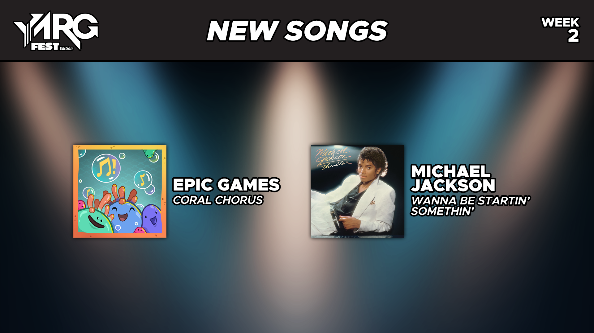

  <picture>
    
  </picture>

[YARG: FEST EDITION DOWNLOAD](https://github.com/VincentWeir/YARG-Fest-Edition) / 
[SUGGESTION/ISSUE FORM](https://forms.gle/72hTusE3i3utg7vt9)

---

## New Songs

Sing it out loud for those startin' somethin' with this week's songs:

'Coral Chorus' - Epic Games
'Wanna Be Startin' Somethin'' - Michael Jackson

New songs are announced every Friday at 12PM ET and released Saturday at 12AM ET.

---

# How to Clone the Setlist Repository

1. Download the [GitHub Desktop application](https://desktop.github.com/download/) and set it up.
2. Go to the [official setlist repository](https://github.com/VincentWeir/YARGFest-OfficialSetlist).
3. Click the green button that says "<> Code". Under "HTTPS", copy the URL or click the icon on the right of the URL (it should say "Copy URL to clipboard" when hovered over).
4. In GitHub Desktop, go to File and click "Clone repository...".
5. Click on "URL". Paste the repository link you copied from Step 3, then click "Clone".
6. Once the repository has been successfully cloned onto your system, click the button on the top row that says "Fetch origin" (or "Pull origin") to make sure you have the latest setlist.
7. Open YARG: Fest Edition. Click on Settings, then Songs.
8. In "Song Folders", click "Add New Folder". Select the setlist folder in the file location of your cloned repository.
  - *TIP: By default, repositories are usually cloned in "C:\Users\ (YOUR NAME) \source\repos".*
9. Click "Scan Songs". Exit out of settings and go to Quickplay.
10. Enjoy the setlist!

# How to Refresh the Setlist Repository for New Song Batches

1. Open the GitHub Desktop Application.
2. With the setlist repository selected, click on "Fetch origin", then "Pull origin".
  - *GitHub Desktop might fetch the origin automatically and simply say "Pull origin".*
3. Open YARG: Fest Edition. Click on Settings, then Songs.
4. Click "Scan Songs". Exit out of settings and go to Quickplay.
5. Enjoy the new song batch(es)!

---

YARG: Fest Edition is a mod created from the original YARG rhythm game (built from v13.1). The aim is to create a new, but familiar, experience for players to be able to play and create songs using a framework that works like Fortnite Festival.

